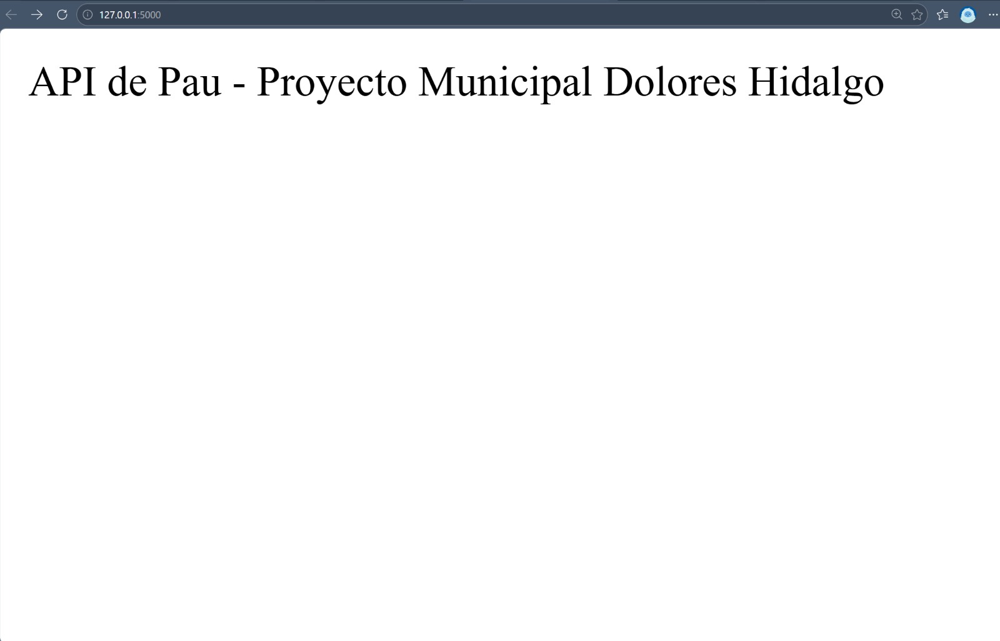
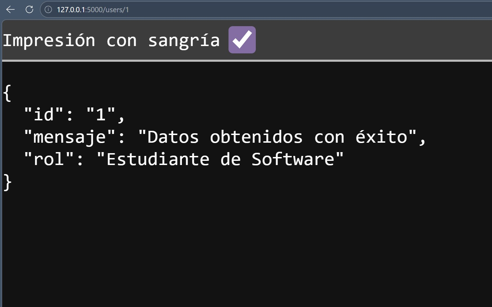
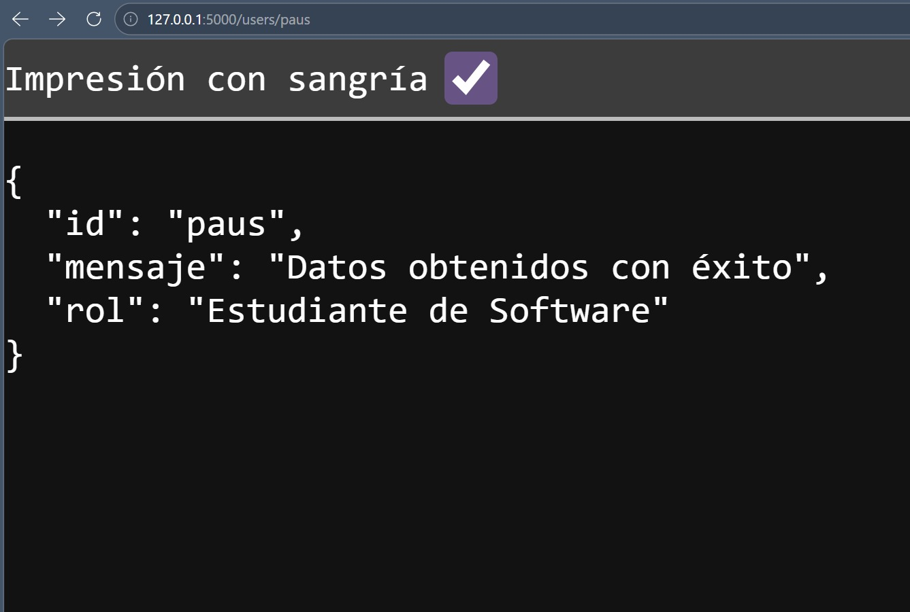
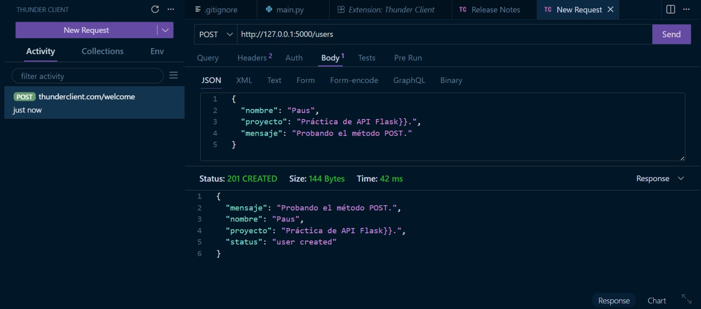

# practica-api-flask

## 📸 Evidencias de Funcionamiento

### 1. Servidor en Ejecución (Ruta Root)
Esta captura muestra que el servidor de Flask está activo y respondiendo correctamente con el mensaje personalizado del proyecto municipal.

### 2. Validación de Endpoint GET (Consulta)
Prueba realizada desde el navegador para verificar la obtención de datos mediante parámetros dinámicos en la URL.

### 3. Validación de Endpoint POST (Thunder Client)
Evidencia de la creación de datos enviando un JSON. Se utilizó Thunder Client como alternativa profesional ante errores técnicos con Postman. Se observa el código de estado **201 CREATED**.

No me funciono el Postman en mi laptop entonces utilice esta extension del Visual que funciona muy parecido. :((

